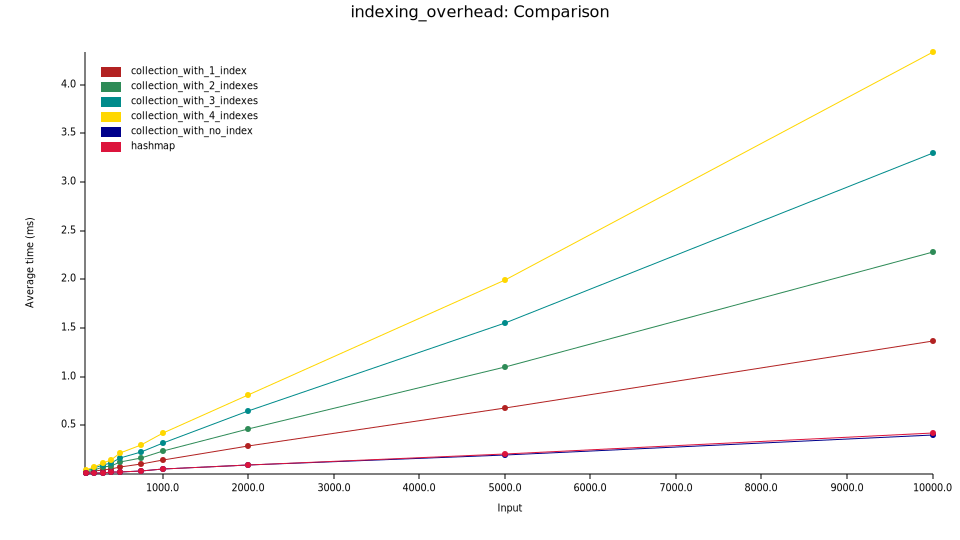

# Performance

`composable-indexes` is designed with performance in mind. The interfaces are designed to compile "out", and only expose the underlying data structures. In other words, think of a `Collection` as a way to translate operations to the underlying index structures at compile time, without adding (significant) runtime overhead. 

Data structures on `composable-indexes` all hold the data entirely in memory. 

> [!NOTE]
> There is no inherent restriction on implementing an on-disk `Store`, indexes backed by disk or even other databases. Just that nobody has done that yet. Let me know if you are interested in working on that!

## Indexes

The common indexes (`btree`, `hashtable`) are simply thin wrappers around `std::collections::BTreeMap` and `std::collections::HashMap`, so you can expect the same performance characteristics as those data structures. They are keyed by the input (usually a field of the stored type) and values are set of pointers to the actual data stored in the collection.

Higher order indexes like `filtered`, `premap` are all zero-cost abstractions and have negligible overhead.

> [!IMPORTANT]
> Because of not doing bookkeeping themselves, the functions passed to higher order indexes should be fast to compute, as they will not be cached and computed on-the-fly. So ideally they are things like field accesses, rather than expensive computations.

## Aggregations

All built-in aggregations are calculated iteratively, without holding the data in memory. You can expect `O(1)` memory and time complexity regardless of the size of the collection.

As an example, `aggregations::count` simply increment and decrement a counter as items are inserted and removed, `aggregations::mean` only keeps track of the sum and count and so on.

## Indexing overhead

A `Collection` is simply a `HashMap`, and indexes are additional data structures. Hence, inserting an element to a `Collection` simply compile down to inserting the element to the underlying `HashMap`, and then inserting pointers to the same element to each of the indexes. Hence, the overhead of adding indexes is linear in the number of indexes.

As an example - on the benchmark below we compare inserting the elements to a `std::collections::HashMap` vs inserting the same elements to a `composable_indexes::Collection` with zero, one, two, three and four indexes. You can see that without an index, the performance is exactly the same as a `HashMap`, and adding an index linearly increases the insertion time.

